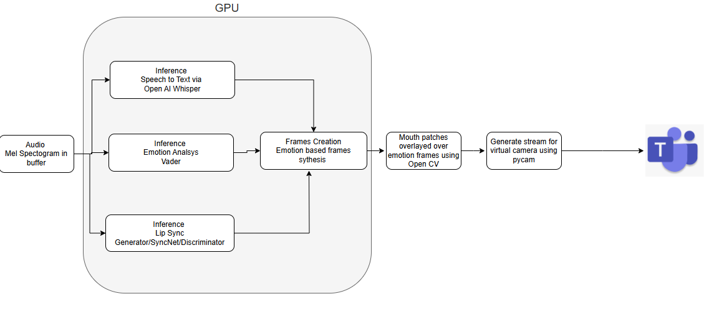
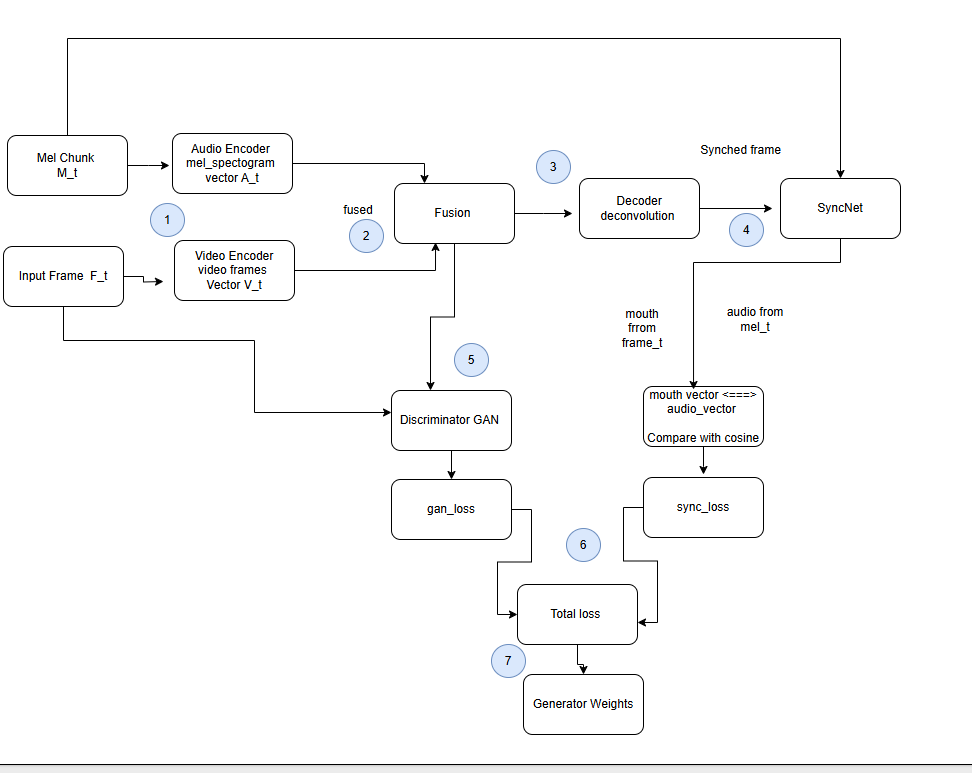
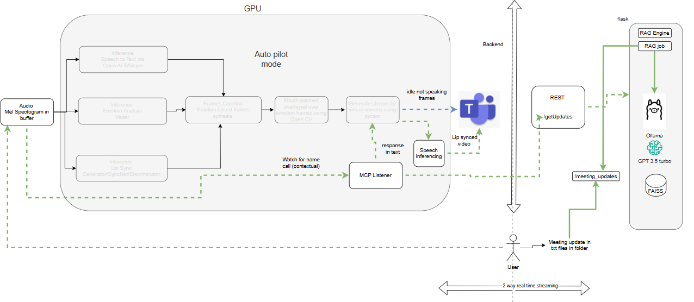

# Human Twin for Microsoft Teams

## Overview
This project introduces an innovative solution to enhance virtual meeting experiences through an autonomous digital twin. Born from the need to streamline daily standup meetings, this virtual human twin serves as an intelligent presence in Microsoft Teams video calls, capable of understanding context and intent while maintaining natural communication.

## Key Features

### Autonomous Client-Side Component
The core of this solution is a sophisticated client-side component that operates independently within Teams meetings. It processes audio input in real-time and performs multiple AI-driven inferences:

- **Speech-to-Text Processing**: Converts spoken words into text for context understanding
- **Emotion Analysis**: Analyzes speech patterns to detect emotional context
- **Real-time Visual Synthesis**: 
  - GPU-accelerated frame manipulation
  - Lip-sync generation synchronized with speech
  - Emotion-driven facial expressions
  - Intent-based visual responses

### Technical Innovation
The system orchestrates multiple AI inferences simultaneously on GPU hardware, achieving real-time performance with minimal latency. This enables seamless integration of speech processing, emotion analysis, and visual synthesis in a fraction of a second.

## Use Cases
- Automated attendance in daily standup meetings
- Virtual presence in routine team meetings
- Intelligent meeting participation with context awareness

## Generator Architecture

### Lip-Sync Generation
The lip-sync generation system utilizes a pre-trained GAN (Generative Adversarial Network) model stored in `gan.pth`. This model has been specifically trained to:

- Convert audio features into precise lip movements
- Maintain temporal synchronization between speech and visual output
- Generate natural-looking facial expressions
- Adapt to different speaking styles and emotions

The pre-trained checkpoint (`gan.pth`) contains the optimized weights and parameters that enable real-time inference while maintaining high-quality visual output. The model architecture is designed to work efficiently on consumer-grade GPUs, ensuring smooth performance during Teams meetings.

## Upcoming: Autopilot Mode (In Development)

### Advanced RAG-Powered Workflow
A new version of the system is currently in development, featuring an autonomous autopilot mode with the following capabilities:

#### Meeting Context Management
- Meeting updates stored in a text file
- RAG (Retrieval-Augmented Generation) workflow integration
- Context building using Ollama GPT-3.5
- Real-time context updates and retrieval

#### Intelligent Response System
- Continuous audio monitoring for contextual triggers
- Automatic RAG endpoint activation on relevant context detection
- Meeting details retrieval via MCP (Meeting Context Protocol)
- Dynamic response generation based on meeting context

#### Enhanced Media Pipeline
- Text-to-speech conversion for natural voice synthesis
- Reverse lip-sync speech synthesis
- Real-time video stream generation
- Seamless integration with Microsoft Teams via PyCam

This advanced version aims to provide a fully autonomous meeting experience, where the digital twin can actively participate in discussions, respond to context, and maintain natural interaction without manual intervention.
